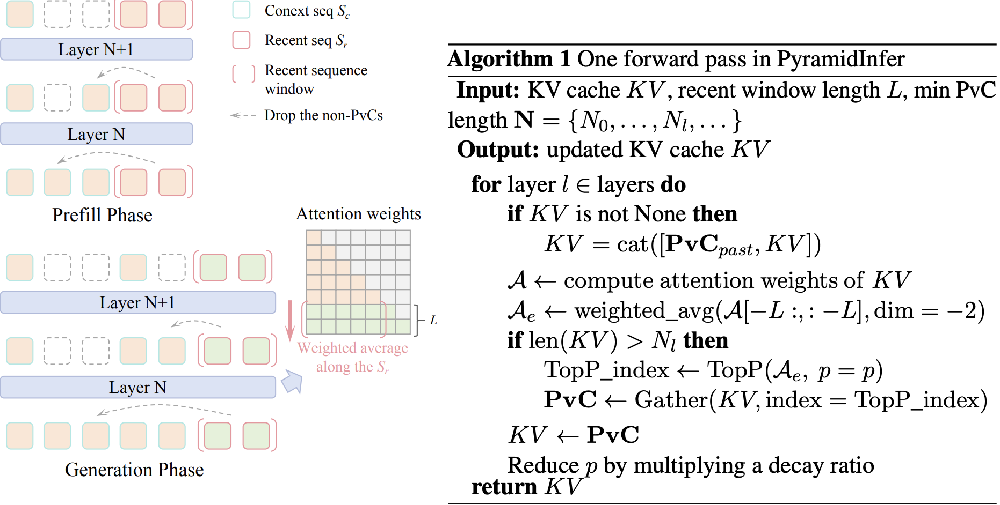

# [ACL 2024] PyramidInfer: Pyramid KV Cache Compression for High-throughput LLM Inference 

Dongjie Yang, Xiaodong Han, Yan Gao, Yao Hu, Shilin Zhang, Hai Zhao

[](https://arxiv.org/abs/2405.12532)

## Updates
- [2024-11-19] We update the implementation of PyramidInfer to be compatible with the latest version of Huggingface transformers `4.46.3`. We rename the legacy code to `modeling_llama_pyramidinfer_legacy.py` which is compatible with the old version of Huggingface transformers `4.31.0`. 
- [2024-06-17] We release the code for PyramidInfer where the details can be found in [here](https://github.com/mutonix/pyramidinfer?tab=readme-ov-file#implementation-of-pyramidinfer).

[WIP] This repository is still under construction. We will release the full code to evaluate the performance of PyramidInfer using the OpenCompass.

## Overview

Large Language Models (LLMs) have shown remarkable comprehension abilities but face challenges in GPU memory usage during inference, hindering their scalability for real-time applications like chatbots. To accelerate inference, we store computed keys and values (KV cache) in the GPU memory. Existing methods study the KV cache compression to reduce memory by pruning the pre-computed KV cache. However, they neglect the inter-layer dependency between layers and huge memory consumption in pre-computation. To explore these deficiencies, we find that the number of crucial keys and values that influence future generations decreases layer by layer and we can extract them by the consistency in attention weights. Based on the findings, we propose PyramidInfer, a method that compresses the KV cache by layer-wise retaining crucial context. PyramidInfer saves significant memory by computing fewer keys and values without sacrificing performance. Experimental results show PyramidInfer improves 2.2x throughput compared to Accelerate with over 54% GPU memory reduction in KV cache.



## Getting Started

### run a demo
We recommend using the PyramidInfer with a large batch size to see more significant memory reduction and efficiency improvement. 
```
conda create -n pyramidinfer python=3.8 -y
conda activate pyramidinfer
pip install -r requirements.txt

python simple_infer_comparison.py --model_name_or_path meta-llama/Llama-2-7b-hf
```

### Implementation of PyramidInfer
Please check the [models/modeling_llama_pyramidinfer.py](https://github.com/mutonix/pyramidinfer/blob/9589c02151c3f6054bf569012f8e24ab7037616f/models/modeling_llama_pyramidinfer.py#L758) to see the implementation of PyramidInfer. More details can be found in the paper.

#### PyramidInfer Configuration
The PyramidInfer has several hyperparameters that can be tuned to achieve better performance. The hyperparameters are defined in the [configs](configs) folder, which are recommended settings for the PyramidInfer.

**Prefilling Stage**
- `recent_ratio`: The ratio of the recent tokens not to be compressed and be used to find PvCs.
- `prefill_decay_ratio`: The decay ratio of gradually reducing the context length as the layer goes deeper.
- `prefill_decay_strategy`: The strategy to decay the context length. It can be `linear` or `cosine`.
- `min_context_length`: The minimum context length to prevent the context length from being too short.
- `layerwise_downsample_interval`: The interval to downsample the context length layer by layer. For larger models with more layers, we do not need to downsample the context length for every layer, which can reduce the additional computations of finding PvCs.
- `distance_weight`: The recent tokens that are closer to the latest token have more weights to find PvCs.

**Generation Stage**
- `gen_decay_ratio`: The decay ratio of gradually reducing the context length as the layer goes deeper in the generation stage. It is a little different from the prefilling stage, which can be checked in [here](https://github.com/mutonix/pyramidinfer/blob/9589c02151c3f6054bf569012f8e24ab7037616f/models/modeling_llama_pyramidinfer.py#L820).
- `gen_decay_strategy`: The strategy to decay the context length in the generation stage. It can be `linear` or `cosine`.
- `exceed_length_to_compress`: The threshold to compress the additional generated tokens. If the number of generated tokens exceeds this threshold, we will compress the additional generated tokens. **Note**: In the generation stage, we do not compress the prompt kv from the prefilling stage, but only compress the additional generated tokens in the generation stage.
- `gen_compress_ratio`: If the number of additional generated tokens exceeds the threshold above, we will compress the additional generated tokens by this ratio.


## Citation
```
@misc{yang2024pyramidinfer,
      title={PyramidInfer: Pyramid KV Cache Compression for High-throughput LLM Inference}, 
      author={Dongjie Yang and XiaoDong Han and Yan Gao and Yao Hu and Shilin Zhang and Hai Zhao},
      year={2024},
      eprint={2405.12532},
      archivePrefix={arXiv},
      primaryClass={id='cs.CL' full_name='Computation and Language' is_active=True alt_name='cmp-lg' in_archive='cs' is_general=False description='Covers natural language processing. Roughly includes material in ACM Subject Class I.2.7. Note that work on artificial languages (programming languages, logics, formal systems) that does not explicitly address natural-language issues broadly construed (natural-language processing, computational linguistics, speech, text retrieval, etc.) is not appropriate for this area.'}
}
```